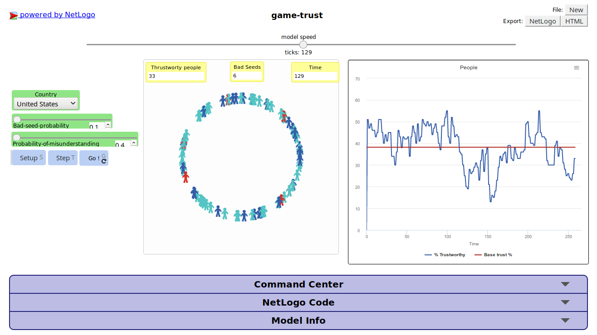

With agent based modeling (ABM) you can show -among other things- how a complex system behaves in a simple way.
I think that a simple problem -with deep [consequences]( https://ourworldindata.org/trust#correlates-determinants-and-consequences)-
that can be modeled -as an easy example- is the lack of trust, let's explore what could happen to a country's level of trust if we play
with a couple of variables using Netlogo (if you want a simple intro about Netlogo please check [I](https://ccl.northwestern.edu/netlogo/docs/),[II](Dante's intro)).
You can play online using this [link](http://netlogoweb.org/web?https://s3.amazonaws.com/alephsa/game-trust.nlogo).
The code is available at [github](https://github.com/nickmancol/game-of-trust)

To play click the **Setup** button (or press the 'S' key) and then click the **Go** button.
In this simple model 100 people select a partner to negotiate with, in the negotiation each agent
choose to trust or defect the other one based on its two previous experiences (the this-for-two-thats strategy),
if my previous two partners let me down this time i will defect my partner, but if my partner trust on me next time i will trust.
Every round (clock tick) after the negotiation a new random network of connections between agents is created and the plot of
people that is willing to trust is updated.

But, as in the real world there are rotten tomatoes which always defect other people, you can configure
the probability that a person behave like that using the first slider. The total number of people that are bad seeds is shown in the
monitor and updated every time that you setup the game

Also, as in the real life, there is a probability that "*something happened*" and at the end of the negotiation one or both agents
misunderstand the result of the negotiation, you think **wrongly** that your partner defected you or viceversa. This affects the way you would
behave in the future. People in blue start trusting to his first partner, people in cyan will not trust at first but are ready to change their minds based on
the interaction.

Play the game several times with the same setup, it will not always show the same results, change the country and sliders values to
explore different base situations. You can also improve the model with new strategies or variables that influence the outcome.
